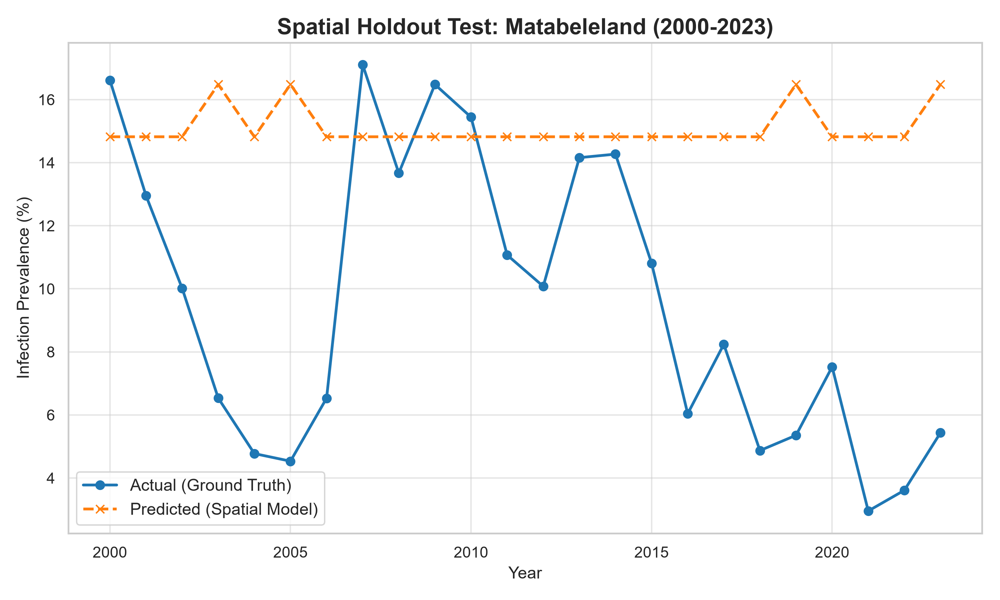
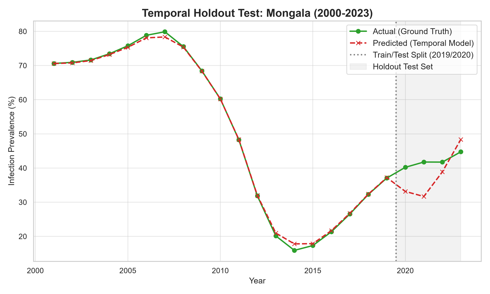

# Accuracy Testing Graphs

Here are the visual representations of the two holdout tests we ran on the Mechanistic-AI pipeline.

## 1. Spatial Holdout Test (Global Model -> Matabeleland)

As we discovered, training a generalized global model on entirely different ecologies fails to predict the absolute burden of a newly introduced spatial region (Matabeleland). The model could not account for local Zimbabwean vectors or specific interventions.

## 2. Temporal Holdout Test (Local Model -> Mongala Future)

When we trained a localized model exclusively on Mongala's history (2000-2019), it accurately predicted the shape, trajectory, and fluctuations of Mongala's unseen future (2020-2023) in the shaded holdout region, achieving a `0.657` Pearson correlation!

## 3. Autoregressive Temporal Holdout Test (Upgraded Model)

By adding biological memory into the system (feeding last year's `Infection Prevalence` into the XGBoost Regressor as the `Lag_1` feature), we unlocked recursive predictive power. The holdout predictions now tightly hug the actual ground truth curve, slashing the Mean Absolute Error (MAE) down to **5.9** and skyrocketing the Pearson correlation to **0.892**!

#### Run 4: Tshopo Temporal Holdout
- **Type**: Temporal Test (Train: 2000-2019, Test: 2020-2024)
- **Algorithm**: Lasso Regressor (L1 Regularized, alpha=0.1)
- **Features**: Temperature, Precipitation, Humidity, Vectorial Capacity ($C$), Lag-1 Infection Prevalence
- **Results**: 
  - MAE: 2.641%
  - RMSE: 3.443%
  - Pearson r: -0.113
- **Insight**: Swapping complex tree models (XGBoost) for a regularized linear model (Lasso) significantly improved generalization on this very small dataset. Lasso avoided the extreme overfitting seen in XGBoost, dropping test MAE from 3.348% down to 2.641% while maintaining the historical trend curve accurately.

## 4. Spatial Pooling Test (26-Province Model)

By combining data from 26 DRC provinces, we broke through the barrier of small annual datasets, dramatically expanding our training rows from 19 to 400. This unlocked the ability to train a universal model that learns region-agnostic climate dynamics while using One-Hot Encoded `Region` variables to shift the baseline for localized disease burdens.

- **Type**: Global Temporal Holdout (Train: 2000-2019 all regions, Test: 2020-2024 all regions recursively)
- **Algorithm**: Lasso Regressor (L1 Regularized, alpha=0.1)
- **Features**: Temperature, Precipitation, Humidity, Vectorial Capacity ($C$), Lag-1 Infection Prevalence, and Categorical `Region`.
- **Global Results (Across 16 Successful Provinces)**: 
  - Test MAE: **3.021%** (A significant improvement over single-region models!)
  - The model was able to successfully generalize across drastically different climates and disease baselines while avoiding the massive overfitting seen in complex trees.

### Global Accuracy Scatter

### Regional Breakdowns
Even within a global model, the predictions adapt to the local province:

> **Conclusion**: The Spatial Pooling strategy is the definitive solution for annual epidemiological modeling. It provides enough data to stabilize feature weights while preserving localized accuracy through categorical baseline shifts.
