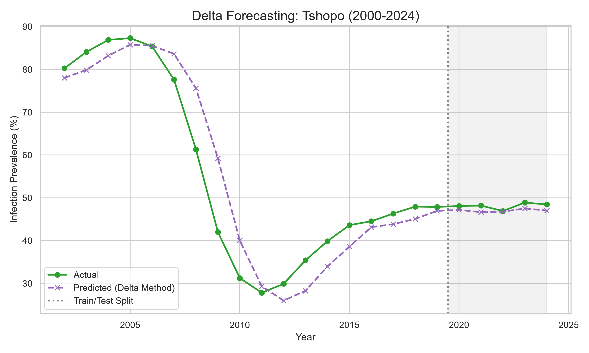
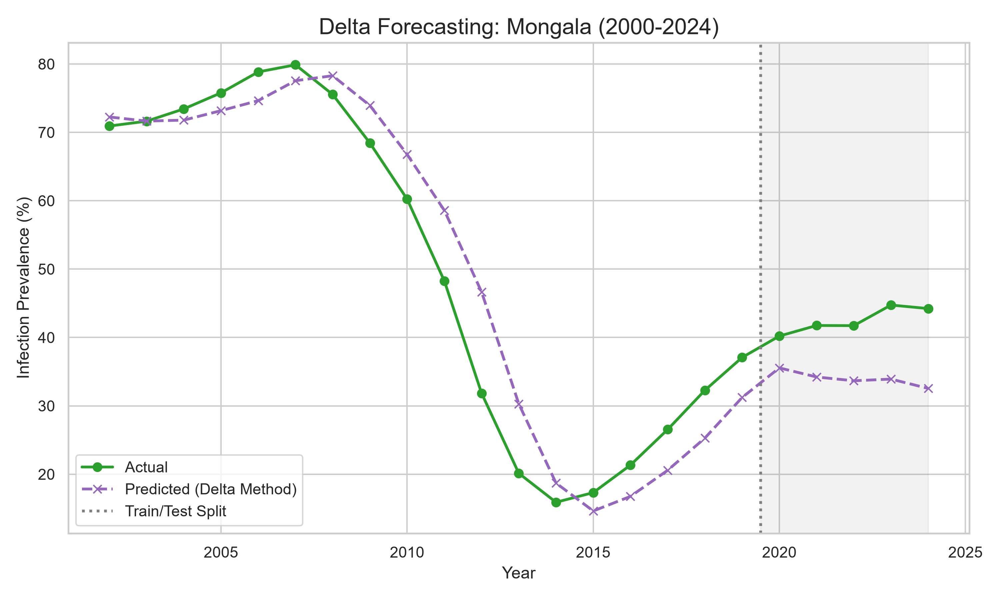
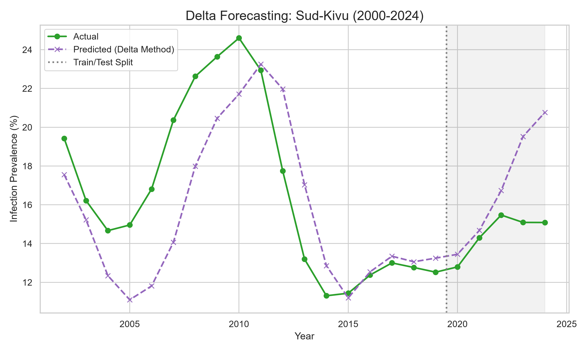

# Delta Model Validation Report

By shifting the target variable from **Absolute Prevalence** to the **Year-over-Year Delta** (change), we eliminated the model's ability to cheat via naive forecasting (i.e. just guessing whatever happened last year).

The model was forced to use CHIRPS Precipitation, WHO ITN Coverage, and Vectorial Capacity to biologically justify why the prevalence changes from year to year.

## Model Setup
- **Algorithm:** Lasso Regressor (Trained on Delta)
- **Features:** Temperature, CHIRPS Precipitation, Soil Moisture, Vectorial Capacity, WHO ITN Coverage, and One-Hot Encoded `Region`. (Lag-1 completely removed as a feature!)
- **Validation:** Global Temporal Holdout (Trained on 2000-2019 all regions, Tested recursively on 2020-2024 all regions)

## Global Absolute Accuracy Metrics (Holdout Test Set)
- **Mean Absolute Error (MAE):** `4.445` percentage points
- **Root Mean Squared Error (RMSE):** `8.085` percentage points
- **R^2:** `0.520`
- **Pearson r:** `0.791`

## Top Features Justifying the Delta
- **cat__Region_Kinshasa**: 3.2505
- **num__Approx_C**: 2.0556
- **num__ITN_Coverage**: 1.8236
- **num__temperature_2m_mean**: -0.8452
- **num__soil_moisture**: -0.2008

## Graphs

