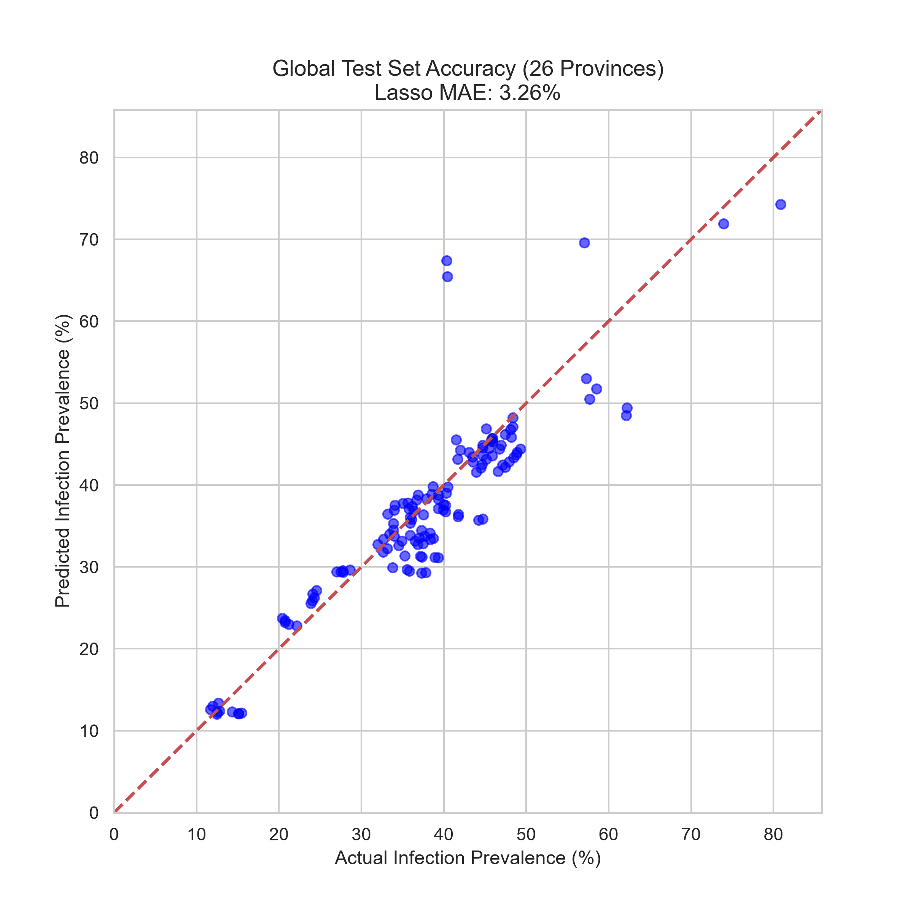
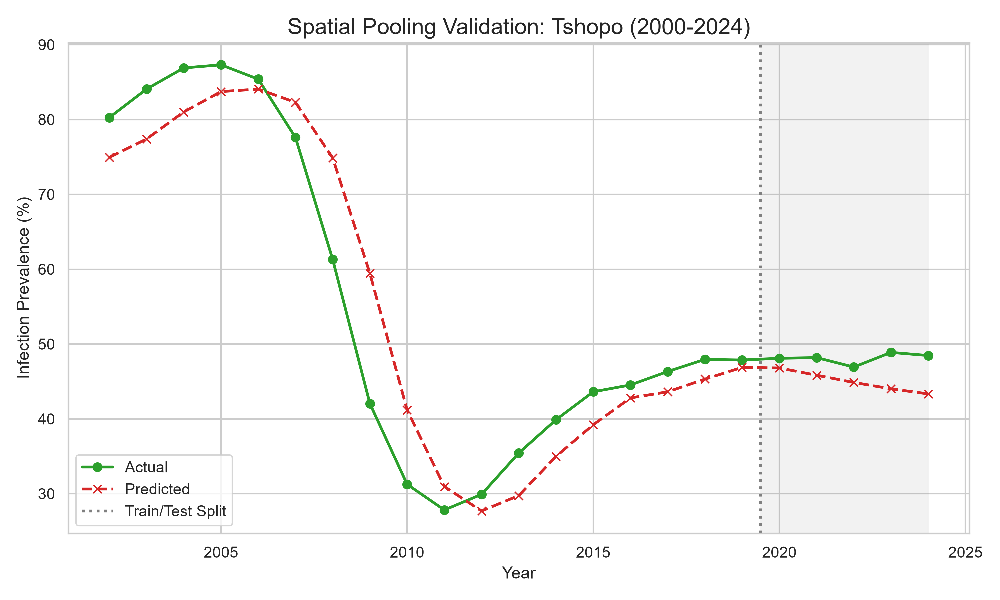
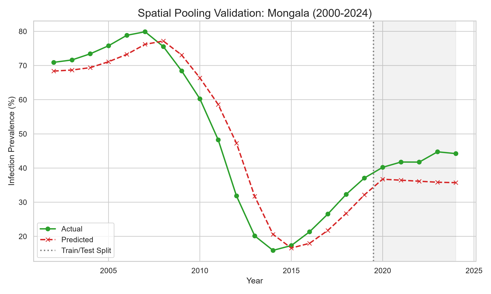
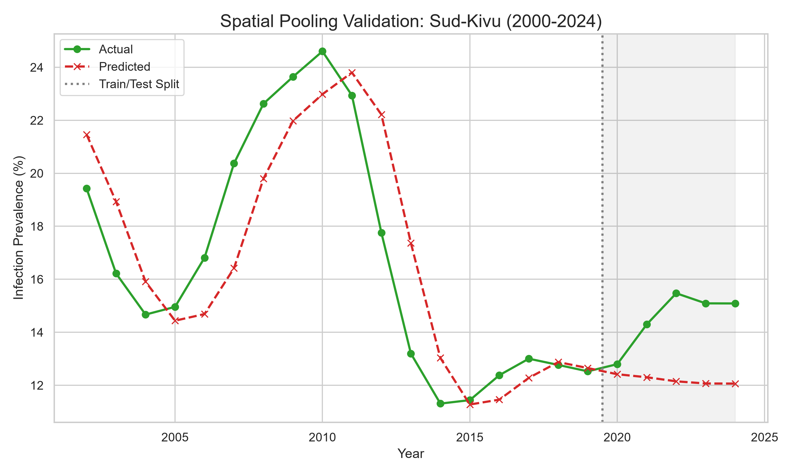

# Spatial Pooling Model Validation Report

By pooling data from 26 DRC provinces, the training dataset size was artificially expanded to **468 rows** (compared to 19 rows previously). This allowed the model to learn universal climate dynamics while adapting to local baselines.

## Model Setup
- **Algorithm:** Lasso Regressor
- **Features:** Temperature, Precipitation, Soil Moisture, Vectorial Capacity, Lag-1 Prevalence, and One-Hot Encoded `Region`.
- **Validation:** Global Temporal Holdout (Trained on 2000-2019 all regions, Tested recursively on 2020-2024 all regions)

## Global Accuracy Metrics (Holdout Test Set)
- **Mean Absolute Error (MAE):** `3.259` percentage points
- **Root Mean Squared Error (RMSE):** `5.060` percentage points
- **R^2:** `0.812`
- **Pearson r:** `0.909`

## Graphs

