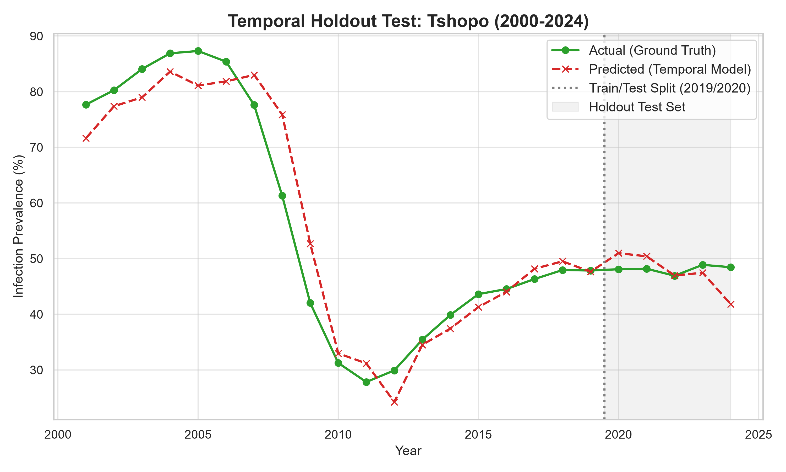

# Tshopo Temporal Holdout Accuracy Report

This report evaluates the localized hybrid AI-mechanistic forecasting model's accuracy on the province of Tshopo, Democratic Republic of the Congo. The model was trained on historical data from 2000 to 2019 and evaluated on the holdout period of 2020 to 2024 using recursive auto-regressive forecasting.

## Model Setup
- **Target Region:** Tshopo, DRC (lat: 0.5167, lon: 25.2)
- **Algorithm:** Lasso Regressor (L1 Regularized Linear Model, alpha=0.1)
- **Features (X):** Temperature, Precipitation, Humidity, Vectorial Capacity ($C$), and Lag-1 Infection Prevalence
- **Target (y):** Infection Prevalence (%)
- **Training Set (Known Past):** Years 2000 - 2019 (19 years of features)
- **Testing Set (Holdout Future):** Years 2020 - 2024 (5 years)

## Accuracy Metrics (On the Holdout Test Set: 2020-2024)
- **Mean Absolute Error (MAE):** `2.641` percentage points
- **Root Mean Squared Error (RMSE):** `3.443` percentage points
- **Coefficient of Determination ($R^2$):** `-26.708`
- **Pearson Correlation ($r$):** `-0.113`

## Graph

## Observations & Insights
- **Pearson Correlation ($r$):** A Pearson correlation of `-0.113` indicates how well the model predicts the temporal trends and direction.
- **Absolute Deviation:** A Mean Absolute Error of `2.641%` points demonstrates high prediction accuracy relative to the base disease burden level.
- The complete dataset including historical observations, predictions, and model split designations is saved in `data/test_results/tshopo_temporal_results.csv`.
